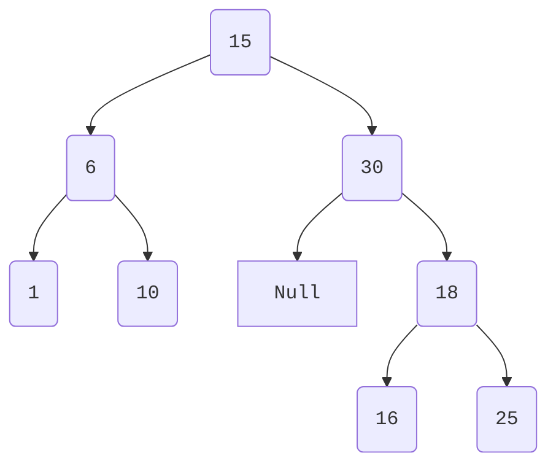
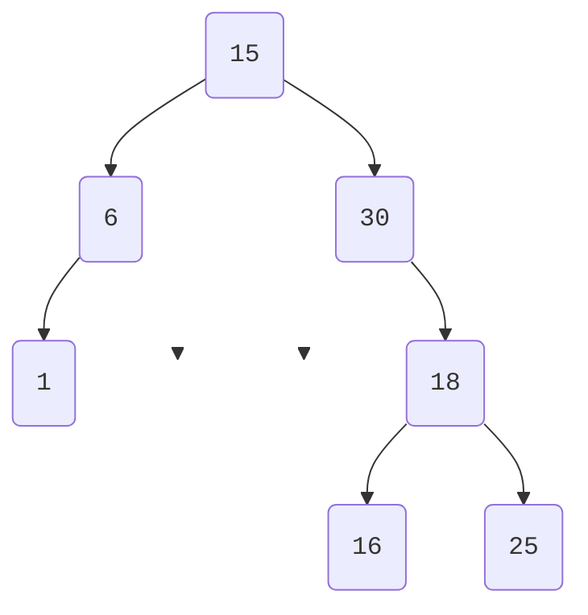
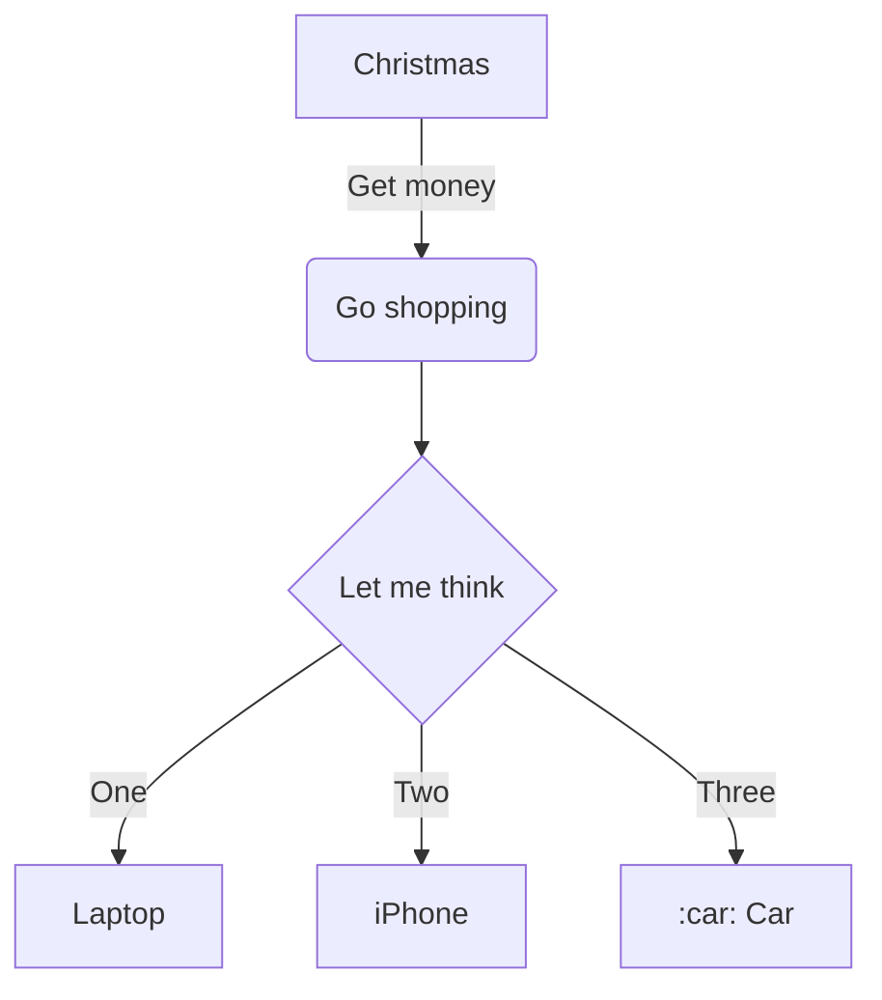

# 📘 Toutes les Admonitions MkDocs Material

:point_right: Ici, avec !!! mais ??? et ???+ possibles

!!! note "Remarque générale"
    Cette boîte sert à ajouter une information complémentaire sans importance critique.

!!! abstract "Résumé ou URL"
    Présente une synthèse ou un aperçu du contenu.

!!! info "Information"
    Fournit une donnée neutre ou contextuelle.

!!! tip "Astuce"
    Donne un conseil ou une bonne pratique.

!!! success "Succès"
    Indique une action réussie ou validée.

!!! question "Question"
    Pose une interrogation ou invite à réfléchir.

!!! warning "Avertissement"
    Signale un risque ou une précaution à prendre.

!!! failure "Échec"
    Informe d’une erreur ou d’un résultat négatif.

!!! danger "Danger"
    Alerte sur un problème critique ou une menace.

!!! bug "Bug"
    Mentionne un dysfonctionnement ou une anomalie.

!!! example "Exemple"
    Illustre un concept ou une méthode.

!!! quote "Citation"
    Met en avant une parole ou un extrait inspirant.

👉 [Un lien d'une ancre d'un doc target=_blank](/simple-siteweb_pyodide/chapitre_plusieurs_pages/chapitre2_page2/#ii-paragraphe-2){:target="_blank" }

👉 [Un lien externe target=_blank](http://github.com/PyMoX-fr){:target="_blank" }

{ width=5%;}
{ width=10%;}
{ width=15%;}

👉 { width=20%; : .center }
Le texte se place **en dessous** de l'image centrée.

{ width=10%; align=right }

👉 Le texte se place **à gauche** de mon image placée à droite.

👉 [Référence :arrow_upper_right:](https://docs.forge.apps.education.fr/modeles/tutoriels/tutoriel-site-simple/02_basique/2_page_basique){.md-button target="_blank" rel="noopener"}

Nous allons utiliser la touche <kbd>2</kbd>

Dans la phrase "Je lis un tutoriel." Le verbe "lis" est au $\hspace{7em}$ de l'indicatif.

---

=== "Panneau 1"
        Ici du texte concernant ce panneau 1

        Il peut prendre plusieurs lignes

    === "Panneau 1"
        Ici du texte concernant ce panneau 1

    === "Panneau 2"
        Ici du texte concernant ce panneau 2

        Un panneau peut prendre plusieurs lignes

---

[Lien vers différentes options de nœuds et flèches](https://coda.io/@leandro-zubrezki/diagrams-and-visualizations-using-mermaid/flowcharts-3){ .md-button target="_blank" rel="noopener" }

[lien vers la documentation mermaid - essais en ligne de mermaid](https://www.mermaidchart.com/play){ .md-button target="_blank" rel="noopener" }

